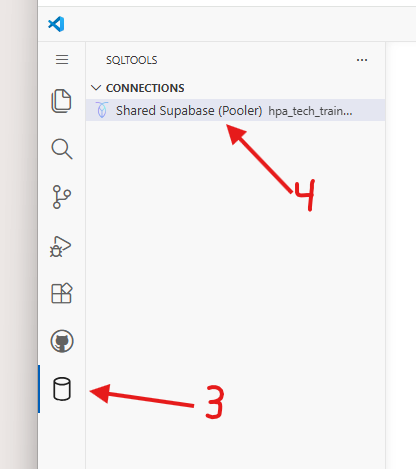
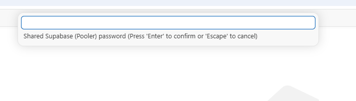
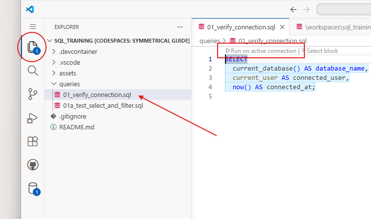

# SQL Training: Connect and Run Queries

This repository is a simple starter for running SQL queries against a shared Supabase database.

You can use either setup path below. Both are fully supported.

## What is included

- SQLTools + PostgreSQL/Cockroach driver setup for Codespaces
- A preconfigured SQLTools connection named `Shared Supabase (Pooler)`
- A sample query in `queries/01_verify_connection.sql`

## Option A: GitHub Codespaces (no install required)

1. Open this repository on GitHub.
2. Click **Code** -> **Codespaces** -> **Create codespace on main**.
3. Open SQLTools in the left sidebar. It may take a minute to appear while the environment finishes setup. It is the small cylinder icon (see 3 in image below).

4. Select the connection **Shared Supabase (Pooler)**.
5. Click the connection. A password prompt appears at the top. Enter the shared class password and press Enter.

6. Go to the file explorer tab (circle in image below), open `queries/01_verify_connection.sql` (arrow), and run it by clicking `> Run on active connection` (square).

If you see database/user/time results, your connection is working.
## Option B: Local VS Code

1. Clone this repository.
2. Open it in VS Code.
3. When VS Code shows extension recommendations, click **Install All**.
4. If no prompt appears, install these manually:
   - `SQLTools` (`mtxr.sqltools`)
   - `SQLTools PostgreSQL/Cockroach Driver` (`mtxr.sqltools-driver-pg`)
5. Open SQLTools from the left sidebar.
6. Select the connection **Shared Supabase (Pooler)**.
7. Click connect and enter the password when prompted.
8. Open `queries/01_verify_connection.sql` and click `> Run on active connection` (same button shown in the Option A image above).
9. If you see database/user/time results, your connection is working.

## Connection details (already prefilled)

- Driver: `CockroachDB`
- Host: `aws-1-us-east-1.pooler.supabase.com`
- Port: `6543`
- Database: `postgres`
- Username: `hpa_tech_train.eiiphhhdravstbmgxvjc`
- SSL: `true`
- Password: entered at connect time

## Quick Troubleshooting

- If SQLTools or the connection does not appear, reload the VS Code window.
- If connect fails, confirm Caps Lock is off and re-enter the password.
